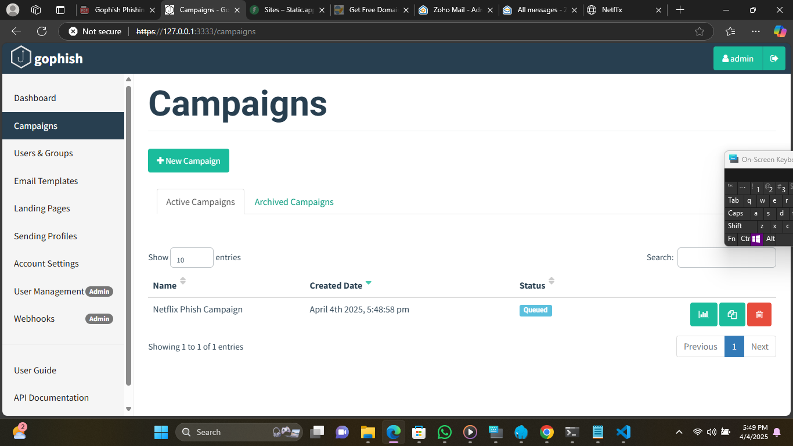
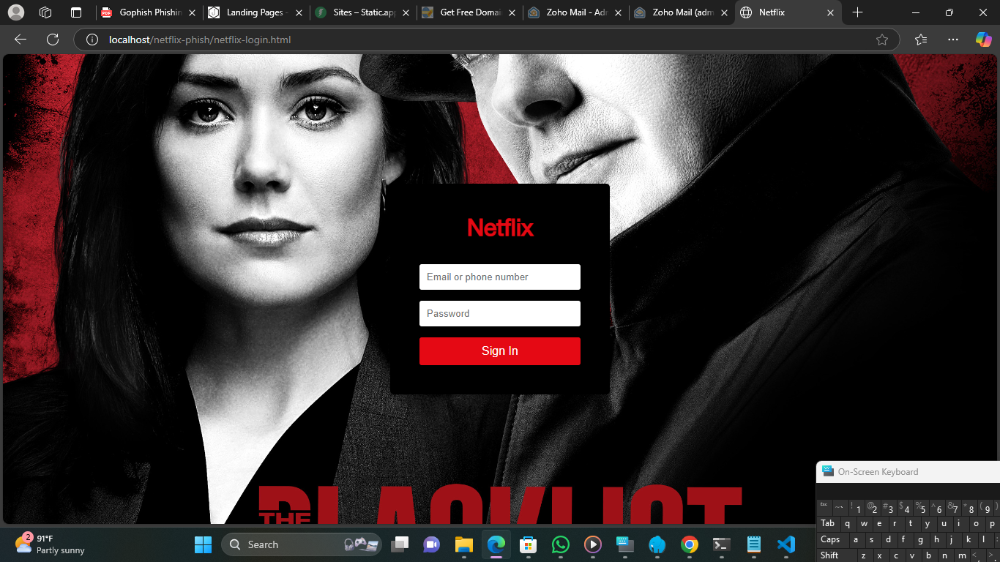
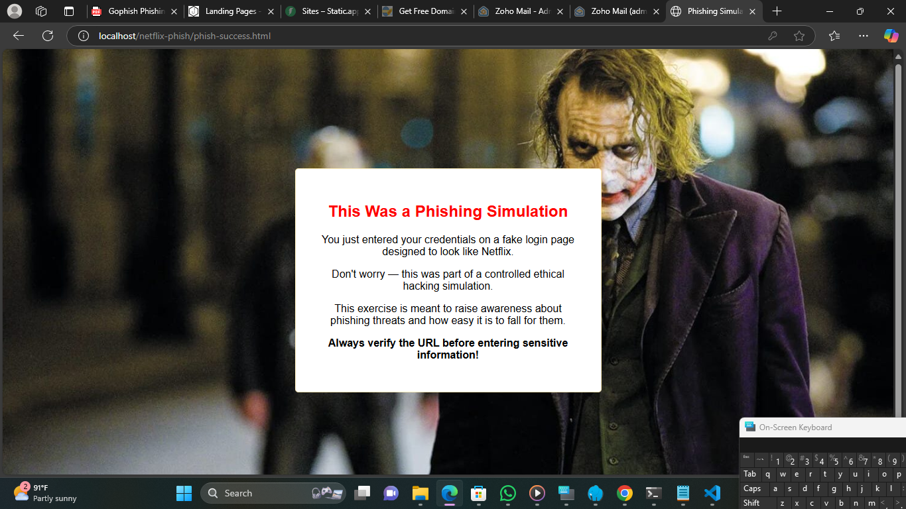
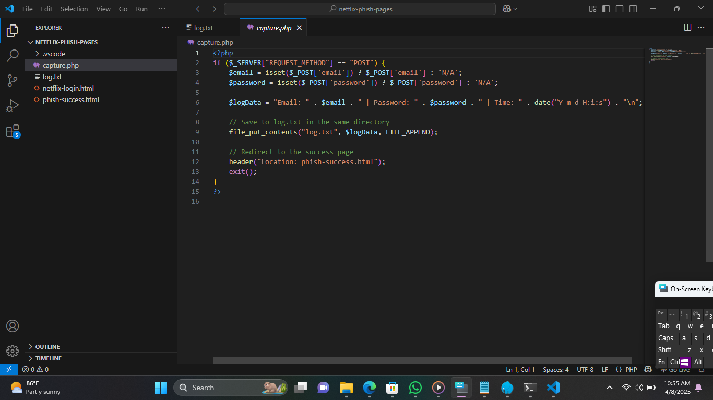
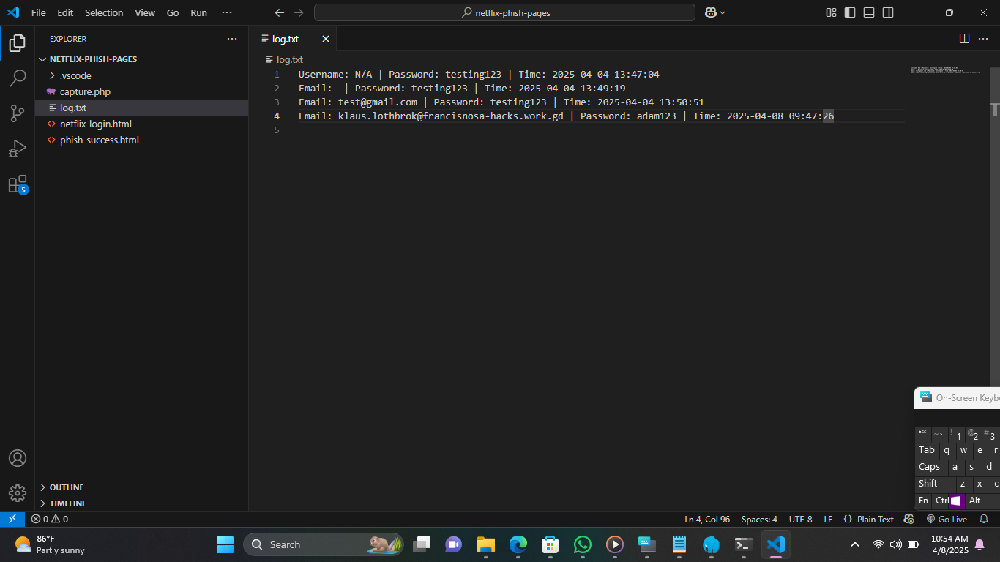
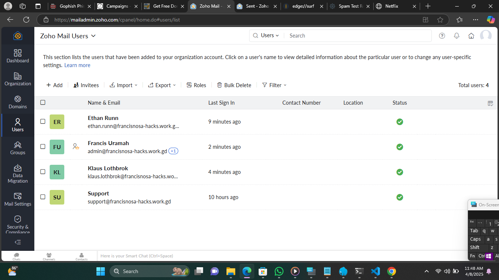
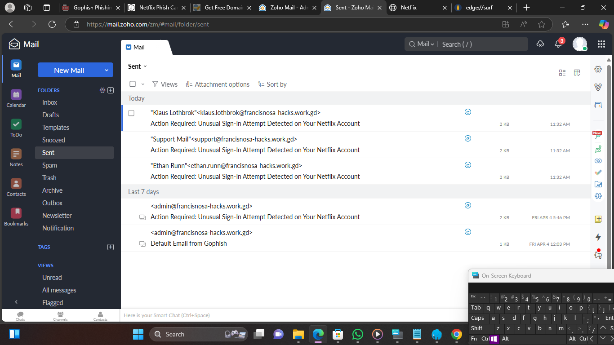
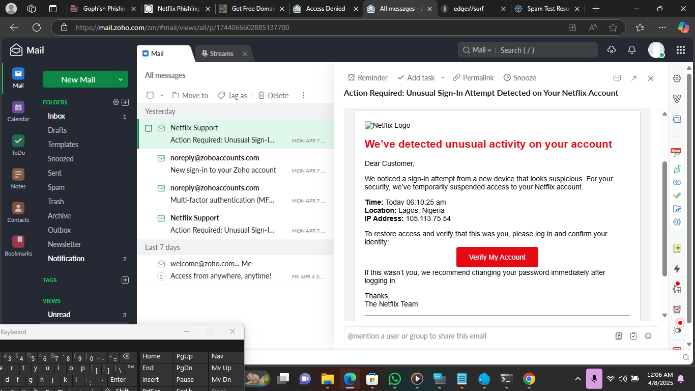
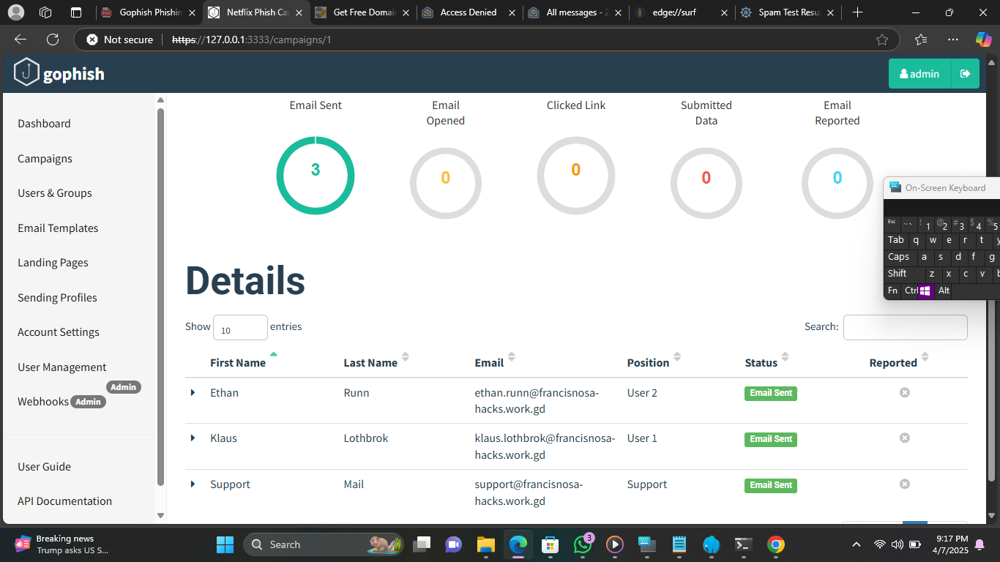

# 🛡️ Gophish-Netflix-Phishing-Campaign

## Project Overview
This project demonstrates my ability to plan, execute, and report a phishing simulation campaign using industry tools such as **GoPhish**, **ZohoMail**, and a local development stack (**Laragon**). It simulates a real-world phishing attack targeting user login behavior on a fake Netflix login page. This was done in a safe and ethical environment, strictly for educational and awareness purposes.

## Objective
To simulate a phishing attack targeting users with a fake Netflix login page to test phishing awareness and credential harvesting exposure among team organization staff.
- Develop a phishing campaign using GoPhish.
- Clone a realistic Netflix login page to serve as the bait.
- Log user credentials upon interaction.
- Redirect users to a success/awareness page.
- Create a detailed campaign report for analysis and portfolio purposes.

## 🔖 Campaign Summary
- Campaign Name: Netflix Security Alert
- Platform Used: Gophish
- Date of Campaign Launch: 04/08/2025
- Duration: Results monitored over 3 days
- Fake landing page hosted locally/on the network: Using Laragon and VSCode
- Picture: Gophish Campaign Created

### 🧪 Project Steps/Methodology

1. **Environment Setup**
   - Installed and configured **GoPhish** on Windows.
   - Set up a **local server** using Laragon to host phishing pages.

2. **Landing Page Creation**
   - Created a **fake Netflix login page** (`netflix-login.html`).
   - Wrote a PHP script (`capture.php`) to log user input into `log.txt`.
   - Redirected users to a custom **phish-success** page (`phish-success.html`).

3. **SMTP & Email Template**
   - Configured SMTP settings using Zoho Mail (with app-specific password due to 2FA).
   - Created a **realistic phishing email** with the sender name “Netflix Support.”
   - Embedded a call-to-action button directing to the fake login page.

4. **Campaign Setup**
   - Created target groups in GoPhish.
   - Tested email deliverability.
   - Launched the campaign with a scheduled trigger.

5. **Logging & Monitoring**
   - Verified that credentials were logged in `log.txt` after test submissions.
   - Monitored HTTP traffic and validated functionality via Wireshark.

6. **Report & Documentation**
   - Created a detailed PDF report and LinkedIn-style carousel.
   - Shared insights and takeaways via a LinkedIn post for visibility.

---

| Tools Used              | Purpose                            |
|-------------------|-------------------------------------|
| GoPhish           | Phishing simulation framework       |
| Laragon (Apache/PHP) | Hosting the fake landing page  |
| Zoho Mail (SMTP)  | Sending phishing emails             |
| HTML/CSS/PHP      | Custom landing and redirect pages   |
| Canva             | Designing report and visuals        |

---

## Artefacts

## 📧 Email Template Details
- Subject Line: Your Netflix Account Requires Verification
- Sender Name: Netflix Security Team
- Sender Email: support@netflix.com (spoofed)
- Email Content Summary: This is a security alert notifying the user of a suspicious login attempt and urging them to verify their account to avoid suspension. The email contains a call-to-action link redirecting to the phishing landing page.

## 🌐 Landing Page Details
- Landing Page Title: Netflix Login Page
- URL: http://localhost/netflix-phish-pages/netflix-login.html
- Website's behavior:
    - Shows the user a fake Netflix login page.
    - If the user attempts to log in, capture.php captures the user's login credentials
    - Capture.php saves credentials to log.txt
    - The user gets redirected to a friendly awareness page (phish-success.html) which informs the user that they've fallen for a test phishing simulation.
- Pictures:
    - Image - Fake login page
    
    

    
    - Image - Page redirects after user logs in
    
    

    
    - Image - Capture.php file showing code used to capture the user's credentials

    

    - Image - Log.txt file showing captured user's credentials

    

## 👥 Target Group(s)
- User Group Name: "Test Users"
- Number of Recipients: 3
- Delivery Method: SMTP via Zoho Mail
- Picture: Zoho Mail Admin Dashboard showing admin profile and test users

## 📊 Results & Metrics
- Emails Sent: 3
- Picture: Emails sent from Admin's Sending Profile

- Emails Opened: 3

- Picture: Email opened in target's inbox

- Emails reported as Spam: 2

- Link Clicks: 2

- Credentials Submitted: 1

- Unique Users Phished: 1 (33%)

- Bounce/Failed Deliveries - Hehehe, funny story. I didn't set **MX, SPF, DKIM, and DMARC** records for my mail service provider when I first launched the campaign, so all the emails got dropped i.e. they didn't make it into the inbox of the targets. I did some troubleshooting and research before I realized that was the issue and then fixed it and relaunched the campaign, this time, there were no bounces or failed deliveries

- Security Awareness Insight: At a **33%** success rate, this campaign showed that **1 in 3** users in my test organization fell for the phishing scam. This sets a bad precedent for this fictional organization as threat actors only need **ONE WEAK LINK**.

## 💡 Lessons Learned
- SMTP authentication can fail due to 2FA – resolved by generating app-specific passwords.
- DNS and SMTP reputation matter for email deliverability.
- Realism in landing pages and email content increases engagement.
- Local hosting (Laragon) is efficient for testing campaigns offline.

## ✅ Recommendations
- Educate users on verifying sender addresses and spotting red flags in suspicious emails.
- Encourage use of multi-factor authentication (MFA) to reduce impact even if credentials are phished.
- Simulate regular phishing tests to improve awareness and build a security-conscious culture.
- Implement secure email gateways with phishing protection rules.

---

## 📂 Supporting Artifacts
Screenshots of:
Email template in inbox

Gophish campaign dashboard showing Mail sent

---

## 👤 Prepared By
- Name: Francis Tochukwu Uramah
- Role: Cybersecurity Analyst
- Date: April 2025

Thank you for reading!
